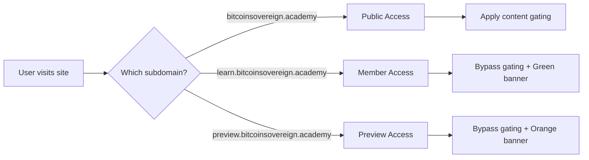

# 🚀 Subdomain Access - Quick Start

## 30-Second Overview

Instead of using URL parameters like `?preview=demo2024`, you now use **subdomains** to control access:

```
Public (gated):     bitcoinsovereign.academy
Members (unlocked): learn.bitcoinsovereign.academy
Preview (demo):     preview.bitcoinsovereign.academy
```

---

## ⚡ Quick Implementation

### 1. Add Scripts to Module Pages (2 minutes)

Find any module page like `paths/curious/stage-1/module-2.html` and add these two scripts in the `<head>`:

```html
<head>
    <!-- ... existing head content ... -->

    <!-- ADD THESE TWO SCRIPTS -->
    <script src="/js/subdomain-access-control.js"></script>
    <script src="/js/module-gate-subdomain.js"></script>
</head>
```

### 2. Add Lock Script to Demos (2 minutes)

For locked demos, add this after `<body>`:

```html
<body>
    <!-- ADD THESE TWO SCRIPTS -->
    <script src="/js/demo-lock-subdomain.js"></script>
    <script src="/js/subdomain-access-control.js"></script>

    <!-- ... existing demo content ... -->
</body>
```

### 3. Configure DNS (15 minutes)

Add these records at your domain registrar:

```
Type     Name      Value
────────────────────────────────────
CNAME    learn     cname.vercel-dns.com
CNAME    preview   cname.vercel-dns.com
```

### 4. Add Domains in Vercel (5 minutes)

Go to **Vercel Dashboard → Your Project → Settings → Domains** and add:

- `learn.bitcoinsovereign.academy`
- `preview.bitcoinsovereign.academy`

### 5. Test It! (2 minutes)

```bash
# Test public (should see gating)
open https://bitcoinsovereign.academy/paths/curious/stage-1/module-2.html

# Test member (should see full access + green banner)
open https://learn.bitcoinsovereign.academy/paths/curious/stage-1/module-2.html

# Test preview (should see full access + orange banner)
open https://preview.bitcoinsovereign.academy/paths/curious/stage-1/module-2.html
```

---

## 🎯 What You Get

### Before (URL Parameters)
```
❌ bitcoinsovereign.academy?preview=UILpVhRGw62d0jPe9GPk
❌ Hard to remember
❌ Looks unprofessional
❌ Easy to lose access (clear cookies)
```

### After (Subdomains)
```
✅ learn.bitcoinsovereign.academy
✅ Clean and memorable
✅ Professional appearance
✅ Persistent access
```

---

## 📁 Files Created

All implementation files are ready to use:

```
js/
  ├── subdomain-access-control.js    (Core subdomain detection)
  ├── module-gate-subdomain.js       (Module content gating)
  └── demo-lock-subdomain.js         (Demo locking)

docs/
  ├── SUBDOMAIN_ACCESS_GUIDE.md      (Full documentation)
  └── SUBDOMAIN_QUICKSTART.md        (This file)
```

---

## 🔍 How It Works



---

## 🧪 Testing Locally

You can test subdomain logic locally using hosts file:

```bash
# Edit /etc/hosts
sudo nano /etc/hosts

# Add these lines
127.0.0.1  bitcoinsovereign.academy
127.0.0.1  learn.bitcoinsovereign.academy
127.0.0.1  preview.bitcoinsovereign.academy

# Start local server
python3 -m http.server 8000

# Visit in browser
http://learn.bitcoinsovereign.academy:8000
```

**Note:** The system auto-detects localhost and grants dev access.

---

## 🎨 Visual Indicators

### Public Access
- No banner
- Content gated after 2 sections
- "Unlock Full Access" overlay

### Member Access
```
┌────────────────────────────────────────────────┐
│ ✅ Member Access Active | All content unlocked │
│                           [← Public Site]      │
└────────────────────────────────────────────────┘
```
- Green banner at top
- All content visible
- Link to return to public site

### Preview Access
```
┌────────────────────────────────────────────────┐
│ 👁️ Preview Mode Active | Demo access enabled  │
│                          [← Public Site]       │
└────────────────────────────────────────────────┘
```
- Orange banner at top
- All content visible
- Link to return to public site

---

## 🔗 Sharing Links

### For Members
```
Send: https://learn.bitcoinsovereign.academy
They get: Full access automatically
```

### For Investors/Reviewers
```
Send: https://preview.bitcoinsovereign.academy
They get: Full demo access
```

### For Public
```
Send: https://bitcoinsovereign.academy
They get: Free preview + upgrade prompts
```

---

## ⚙️ Configuration

### Change Free Demo List

Edit `js/subdomain-access-control.js` line ~109:

```javascript
const freeDemos = [
    'account-freeze-locked-out',
    'building-the-chain-demo',
    'double-spending-demo',
    'money-properties-comparison',
    'network-consensus-demo',
    // Add more free demos here
];
```

### Change Preview Sections

Edit `js/module-gate-subdomain.js` line ~4:

```javascript
const previewLimit = 2; // Number of free sections
// Change to 3 or 1 as needed
```

---

## 🛠️ Troubleshooting

### "Gating still shows on learn subdomain"

**Check browser console:**
```javascript
window.BSASubdomainAccess.getAccessLevel()
// Should return: "member"
```

**If it shows "public":**
```javascript
// Clear storage
localStorage.clear();
sessionStorage.clear();
location.reload();
```

### "Scripts not loading"

**Check Network tab in DevTools:**
- Look for 404 errors
- Verify script paths are correct
- Check file permissions

### "Subdomain not working"

**Verify DNS:**
```bash
dig learn.bitcoinsovereign.academy
# Should show CNAME record
```

**Check Vercel:**
- Dashboard → Domains → Should see "learn" and "preview"
- SSL should show green checkmark

---

## 📊 Comparison: Old vs New

| Feature | URL Parameters | Subdomains |
|---------|---------------|------------|
| **URL** | `?preview=key` | `learn.domain.com` |
| **Professional** | ❌ | ✅ |
| **Memorable** | ❌ | ✅ |
| **SEO-Friendly** | ❌ | ✅ |
| **Shareable** | ⚠️ | ✅ |
| **Analytics** | ⚠️ | ✅ |
| **Setup Time** | 0 min | 20 min |
| **Maintenance** | Low | Low |

---

## 🎯 Next Actions

1. **Read full guide:** `SUBDOMAIN_ACCESS_GUIDE.md`
2. **Configure DNS:** Add CNAME records
3. **Add to Vercel:** Add subdomains to project
4. **Update pages:** Add scripts to HTML files
5. **Test thoroughly:** All three subdomains
6. **Launch:** Email members with new URLs

---

## 💡 Pro Tips

1. **Gradual Migration**
   - Start with one module
   - Test thoroughly
   - Migrate rest when confident

2. **Backwards Compatibility**
   - Old `?preview=` links still work
   - No need to update all at once
   - Migrate at your own pace

3. **Member Communication**
   - Send announcement email
   - Include new URL prominently
   - Explain benefits clearly

4. **Monitoring**
   - Set up UptimeRobot for all subdomains
   - Monitor access patterns in analytics
   - Track conversion from public → member

---

## 🚀 Ready to Launch?

Once DNS is configured and scripts are added:

```bash
# Deploy to production
git add .
git commit -m "Add subdomain-based access control"
git push origin main

# Verify deployment
vercel --prod
```

Visit your subdomains and enjoy the new system! 🎉

---

**Questions?** Check `SUBDOMAIN_ACCESS_GUIDE.md` for detailed documentation.

**Last Updated:** 2025-10-31
